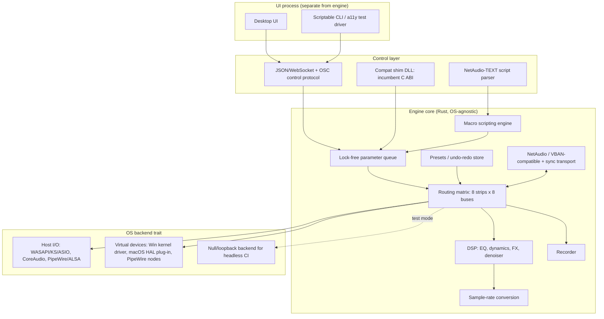

# Scope and architecture

## Scope

Build the Max feature set only. Not Standard, not Plus. Every row in `feature-test-matrix.csv` targets Max-level functionality: the full 34-in/64-out routing matrix, all FX, the full NetAudio stack, Macro Buttons, the full Remote API surface, and the Part 3 network use cases. Standard and Plus are smaller than Max in every dimension the reference documents, so building to Max covers them; we do not build separate reduced editions.

Fixing the reference's Part 2 defects is in scope by design (decision spine #7): undo/redo, auto device reconnect, per-app volume, resizable/DPI-aware UI, an optional clock-sync transport, an optional encrypted transport, no licence nag, and CLAP plugin hosting as a later milestone. These are not bonus features; they are load-bearing requirements captured as `defect-fix` rows in the matrix.

Out of scope for the initial build: Dolby/DTS/Atmos bitstream passthrough, and any feature the reference marks as Standard/Plus-only with no Max-level equivalent.

## Component diagram



The UI is never in the audio path. It talks to the engine only through the control protocol, the same protocol external controllers (Stream Deck, Companion, custom scripts) use. This is what makes the UI screenshot/a11y-testable and swappable: a second UI implementation, or none at all (headless server mode), is a supported configuration, not a hack.

## Crate/module layout

```
openmix/
  engine-core/        # matrix, DSP graph, SRC, presets, undo/redo, scripting VM
  engine-dsp/         # EQ, dynamics, FX, denoiser, reverb, metering (audio-thread safe)
  engine-net/         # VBAN-compatible plain transport, sync transport, NetAudio-TEXT/MIDI/FRAME
  engine-recorder/    # WAV/AIFF/BWF/MP3 writers, format negotiation
  control-protocol/   # JSON/WebSocket + OSC server, parameter grammar (Strip[i].Gain, ...)
  compat-shim/        # C ABI DLL matching the incumbent's exported functions
  backend-trait/      # the OS-backend trait definition, shared types
  backend-null/       # null/loopback backend, 100% of engine tests run on this in CI
  backend-windows/    # WASAPI/KS/ASIO host I/O + kernel driver client glue
  backend-macos/      # CoreAudio host I/O + HAL plug-in client glue
  backend-linux/      # PipeWire/ALSA host I/O + PipeWire virtual node glue
  driver-windows/     # the signed kernel driver itself (isolated workstream, see 02-workstreams.md)
  driver-macos/       # the HAL AudioServerPlugIn bundle
  ui/                 # separate process, talks only to control-protocol
  test-harness/       # offline render harness, golden fixtures, interop rig, perf rig
```

`engine-core`, `engine-dsp`, `engine-net`, `engine-recorder` and `control-protocol` depend on nothing OS-specific and build and test on any CI runner using `backend-null`. `backend-windows`, `backend-macos`, `driver-windows` and `driver-macos` are the only crates that require their target OS to build; they are behind feature flags so a Linux CI runner never needs to compile them.

## The OS-backend trait

One trait, implemented once per platform plus once for tests:

```rust
trait AudioBackend {
    fn enumerate_devices(&self) -> Vec<DeviceInfo>;
    fn open_stream(&self, device: DeviceId, cfg: StreamConfig) -> Result<StreamHandle, BackendError>;
    fn close_stream(&self, handle: StreamHandle);
    fn on_device_change(&self, cb: Box<dyn Fn(DeviceEvent) + Send>);
    // ... buffer callback registration, latency query, exclusive-mode negotiation
}
```

Engine code never calls WASAPI, CoreAudio or PipeWire directly. It calls this trait. `backend-null` implements it with an in-process ring buffer and a virtual clock driven by the test harness, so every engine-level acceptance test (matrix, DSP, recorder, presets, scripting, control protocol, NetAudio) runs on a plain Linux CI runner with no audio hardware and no OS-specific code compiled. This is what makes "100% of engine tests run headless" (decision spine #2) literal, not aspirational: any test that cannot pass against `backend-null` is testing the wrong layer and belongs in `backend-windows`/`backend-macos`/`backend-linux`'s own (much smaller) test suite instead.

Virtual devices (the thing other applications select as their input/output device) are a second, separate concept from host I/O, handled by `VirtDev` in the diagram: a Windows kernel driver, a macOS HAL plug-in, or PipeWire virtual nodes. These are OS-specific by nature and cannot be null-backed; see `02-workstreams.md` for the driver risk treatment.

## Control protocol and compatibility shim

One canonical control protocol: JSON over WebSocket for structured calls and subscriptions, plus OSC for controllers that expect it (this is decision spine #4). The parameter grammar mirrors the incumbent's own naming (`Strip[i].Gain`, `Bus[j].Mute`, and so on) so existing mental models, scripts and NetAudio-TEXT command strings port with minimal translation. NetAudio-TEXT scripts are accepted verbatim, not just "similar syntax."

A thin compatibility shim DLL exposes the incumbent's C ABI (the function signatures a Remote API DLL is expected to export) and translates each call to the canonical protocol under the hood. Existing third-party wrappers (Python, Go, Node), Stream Deck plugins and Companion modules that talk to the incumbent's Remote API DLL load this shim instead and keep working unmodified. This is a compatibility layer, not the primary API: new integrations should use the JSON/WebSocket/OSC protocol directly.

## Network transports

Two transports, both decision spine #5:

- **VBAN-compatible plain streams**: wire-compatible with the VBAN family (header, sub-protocols AUDIO/SERIAL/TEXT/FRAME/PING, sample-rate table, packet limits) for interop with existing third-party VBAN senders/receivers with zero modification on their side.
- **Sync transport** (optional): timestamped packets for tighter multi-room alignment, optional forward error correction for lossy Wi-Fi/VPN links, optional authenticated encryption for untrusted networks. This is new, not VBAN-compatible, and is explicitly a superset offered alongside the plain mode, never a replacement for it.

## UI as a separate process

The UI is DPI-aware, themeable (light/dark, no fixed pixel layout), resizable, and accessible (a11y tree exposed for automated testing). It runs as its own process and speaks the control protocol exclusively, which gives three things at once: the engine can run headless (server mode, no UI at all), the UI can be screenshot- and a11y-tree-tested against a running engine without any audio hardware, and a second/alternate UI is a legitimate configuration rather than a fork.

## The numbers that matter (from the reference, must match)

| Item | Value | Where it lands in the design |
|---|---|---|
| Input strips | 8 total: 5 hardware (stereo, 10 ch) + 3 virtual (8 ch each) | Routing matrix row count |
| Output buses | 8 total: A1-A5 (physical, up to 8 ch each) + B1-B3 (virtual, 8 ch each) | Routing matrix column count |
| Insert/monitor channel count | 34 channels (5x2 + 3x8), pre-fader by default, switchable PRE-FX/POST-FX | Insert virtual device channel count |
| Total output channel count | 64 (A buses up to 40 + B buses 24) | Virtual output device channel count |
| Engine/master sample rates | 32, 44.1, 48, 88.2, 96, 176.4, 192 kHz | `StreamConfig` sample-rate enum |
| NetAudio per-stream sample rates | 11025, 16000, 22050, 24000, 32000, 44100, 48000, 64000, 88200, 96000 Hz, 16/24-bit, 1-8 ch | `engine-net` stream negotiation |
| Buffer sizes | MME-equivalent 512-2048 (default 1024); WDM/KS-equivalent down to 256 (default 512); control-protocol accepts 128-2048 | `StreamConfig` buffer-size range |
| NetAudio streams | 8 incoming, 8 outgoing audio streams, plus NetAudio-MIDI, NetAudio-TEXT, NetAudio-FRAME | `engine-net` stream slot count |
| Virtual ASIO clients per driver | 4 client applications each, 3 virtual ASIO drivers | `driver-windows` / ASIO workstream target (see risk treatment) |
| Remote-API-equivalent clients | up to 8 concurrent control-protocol clients | `control-protocol` connection limit |

These numbers are contract, not suggestion: any implementation that hard-codes a smaller matrix, a shorter sample-rate list, or a lower client count fails its acceptance test even if the code otherwise works.
